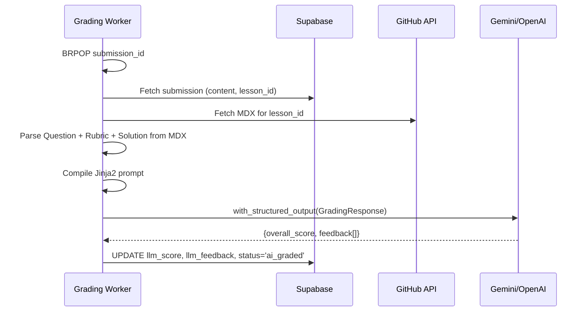

# Phase 3.5 — LLM-Assisted Grading Walkthrough

## What Was Built

A complete LLM grading pipeline that automatically scores exercise submissions using Langchain, structured output enforcement, and rubric-based criteria.

### Architecture



---

## Files Changed

### New Files (Backend)

| File | Purpose |
|---|---|
| [llm.py](file:///Users/nguyen/Documents/Workspace/GitHub/cs4all/cs4all-backend/app/services/llm.py) | Langchain grading: Gemini → OpenAI fallback, structured output |
| [github.py](file:///Users/nguyen/Documents/Workspace/GitHub/cs4all/cs4all-backend/app/services/github.py) | GitHub API: fetch MDX, parse ExerciseBlock, extract Question/Solution/Rubric |
| [prompt.py](file:///Users/nguyen/Documents/Workspace/GitHub/cs4all/cs4all-backend/app/services/prompt.py) | Jinja2 grading prompt template (user-editable) |
| [migration](file:///Users/nguyen/Documents/Workspace/GitHub/cs4all/cs4all-backend/supabase/migrations/20260223000000_add_grading_failed_status.sql) | Adds `grading_failed` to status CHECK constraint |

### New Files (Frontend)

| File | Purpose |
|---|---|
| [Rubric.astro](file:///Users/nguyen/Documents/Workspace/GitHub/cs4all/cs4all-frontend/src/components/blog/Rubric.astro) | Hidden wrapper: `data-exercise-role="rubric"` |

### Modified Files

| File | Changes |
|---|---|
| [grading_worker.py](file:///Users/nguyen/Documents/Workspace/GitHub/cs4all/cs4all-backend/app/workers/grading_worker.py) | Full Phase 3.5 pipeline replacing Phase 3 log-only |
| [pyproject.toml](file:///Users/nguyen/Documents/Workspace/GitHub/cs4all/cs4all-backend/pyproject.toml) | +langchain-core, langchain-google-genai, langchain-openai, jinja2 |
| [config.py](file:///Users/nguyen/Documents/Workspace/GitHub/cs4all/cs4all-backend/app/core/config.py) | +`llm_model` setting |
| [.env.example](file:///Users/nguyen/Documents/Workspace/GitHub/cs4all/cs4all-backend/.env.example) | +`LLM_MODEL` |
| [exercise-block.tsx](file:///Users/nguyen/Documents/Workspace/GitHub/cs4all/cs4all-frontend/src/components/ui/exercise-block.tsx) | Rubric parsing comments |
| [index.mdx](file:///Users/nguyen/Documents/Workspace/GitHub/cs4all/cs4all-frontend/.content/note/prml/1-exercise/index.mdx) | +`<Rubric hidden>` blocks on exercises 1-1 and 1-2 |

---

## Testing Instructions

> [!IMPORTANT]
> **Before testing**, you must:
> 1. Run migration [20260223000000_add_grading_failed_status.sql](file:///Users/nguyen/Documents/Workspace/GitHub/cs4all/cs4all-backend/supabase/migrations/20260223000000_add_grading_failed_status.sql) via Supabase Dashboard
> 2. Set `GEMINI_API_KEY` (or `OPENAI_API_KEY`) and `GITHUB_TOKEN` in `.env`
> 3. Have Redis running

```bash
# Terminal 1: Start the FastAPI dev server
cd cs4all-backend
uv run uvicorn app.main:app --reload --port 8000

# Terminal 2: Start the grading worker
cd cs4all-backend
uv run python -m app.workers.grading_worker

# Terminal 3 (optional): Verify health
curl -s http://localhost:8000/api/v1/health | python3 -m json.tool
```

Then submit an exercise via the frontend. The worker logs will show the full pipeline (GitHub fetch → LLM grading → DB write).

---

## Key Design Decisions

1. **Rubric in MDX, not frontmatter**: `<Rubric hidden>` component inside ExerciseBlock — allows per-exercise criteria JSON without changing the content schema
2. **Jinja2 prompt template**: User-editable at [prompt.py](file:///Users/nguyen/Documents/Workspace/GitHub/cs4all/cs4all-backend/app/services/prompt.py) — English prompt with `language` field for Vietnamese context
3. **Alternative-approach-tolerant grading**: Prompt explicitly instructs the LLM to accept mathematically valid alternative approaches
4. **`grading_failed` status**: Permanent LLM failures are marked so submissions don't stay stuck in `submitted`
